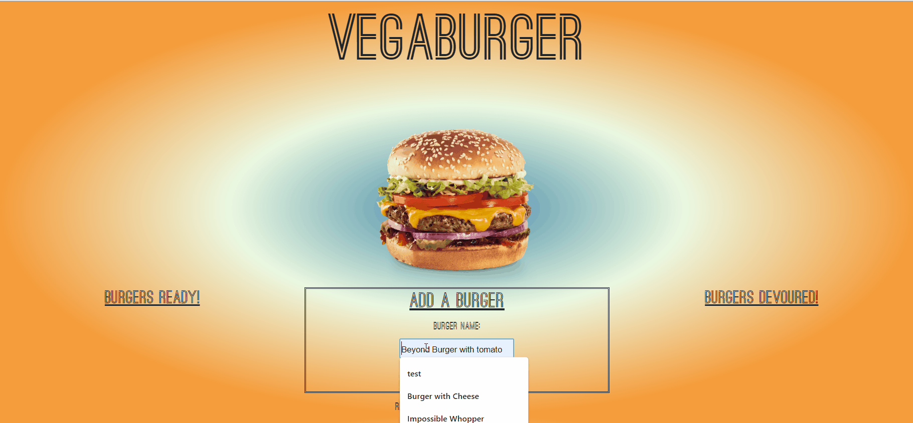

# VegaBurger

# VegaBurger
* Create a burger list and devour them on command! Then delete them from your list at your leisure!

## Table of Contents
1. Installation 

## Installation
* Navigate to https://vegaburger.herokuapp.com/

## Instructions for Use
* Insert burger name into input box. Select "Add Burger" or hit enter. Burger will be displayed on left side. Select "Devour" to move to 'Burgers Devoured' list. To remove burgers from 'Devoured' list select remove button.

## License
* MIT

## Contributors
* ryanhun7er

## Testing
* n/a

## Contact

* @ryanhun7er

* ryanhwilkinson@icloud.com

* Nashville, TN

* https://github.com/ryanhun7er
